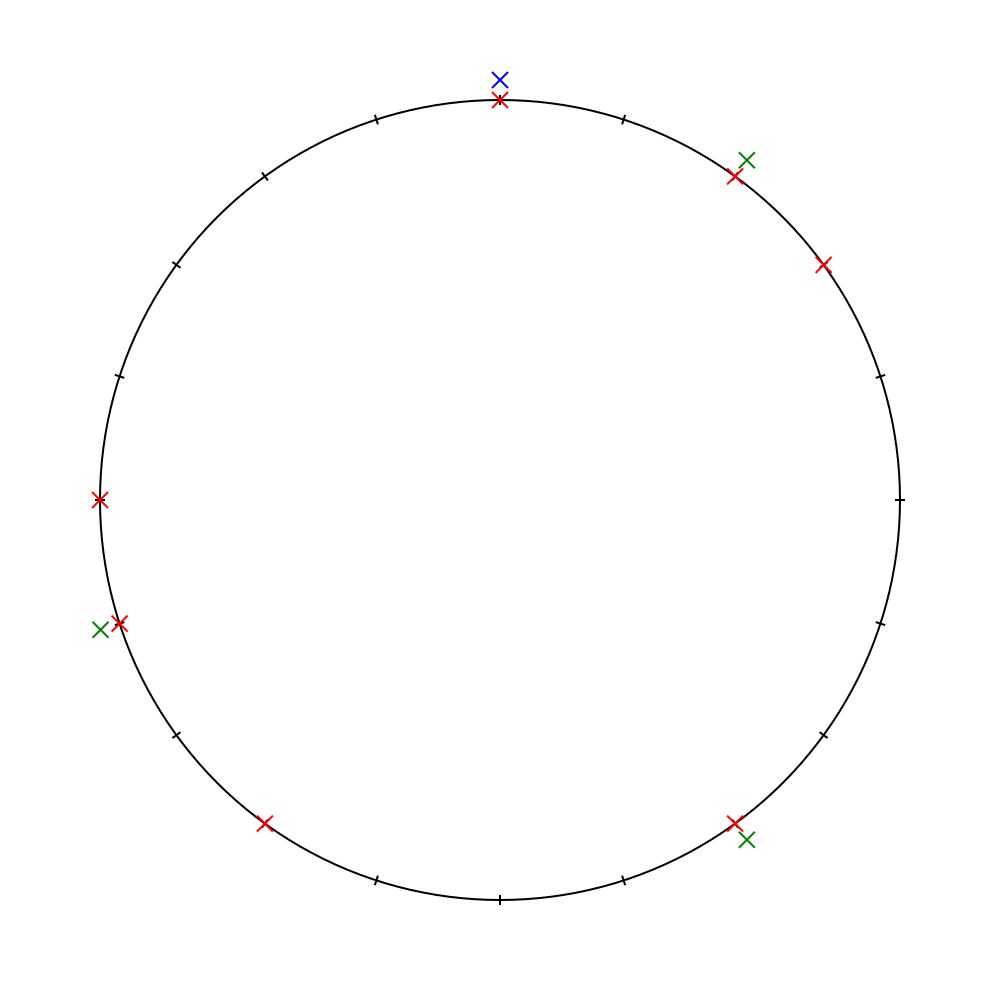

# bwinf
39. BWINF, zweite Runde

## Aufgabe 3: Eisbuden am See als SVG anzeigen

Beispiel: `./svgout Beispieleingaben/eisbuden1.txt 2 8 14`

 - Rot: Häuser
 - Blau: Position 0
 - Grün: Position der Eisbuden

Ausgabe:

